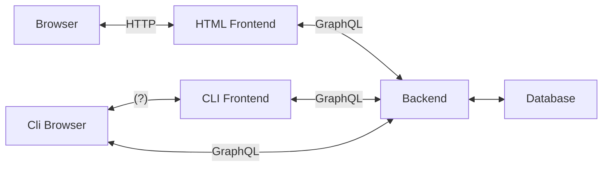
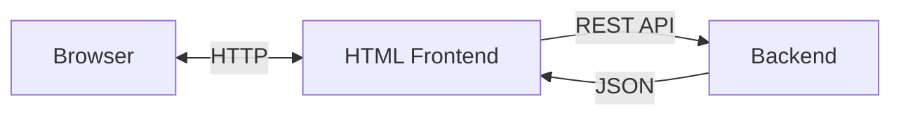

# PROJECT MOSES

## Architecture

### TOBE(?)

- Brower: Chrome, Firefox, Safari, etc.
- HTML Frontend: Create HTML using moses-frontend-lib.
- moses-frontend-lib: Create a request of GraphQL and convert the response to ts object(?).
- Backend: Return blog content as JSON.
- Database: Store blog contents.
- Cli Browser: Blog viewer for CLI.
- CLI Frontend: Respond to requests from Cli Browser using the new protocol.

### Current
